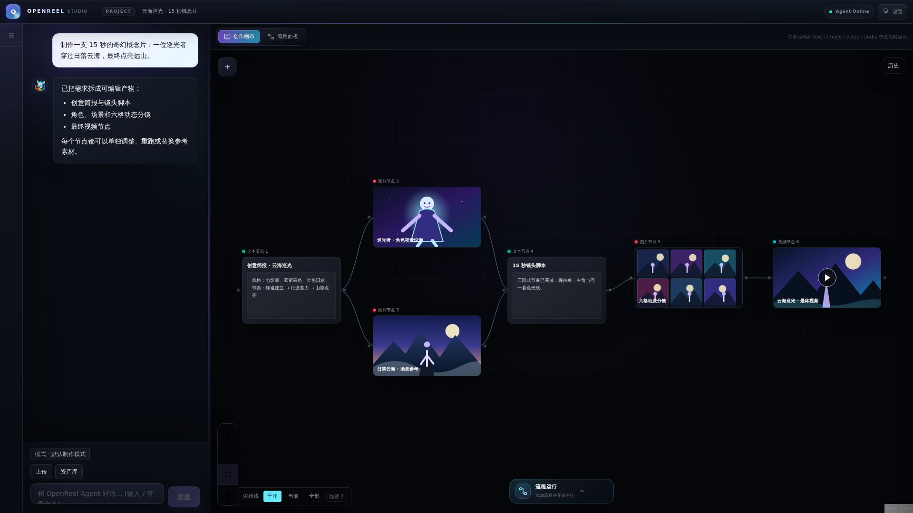
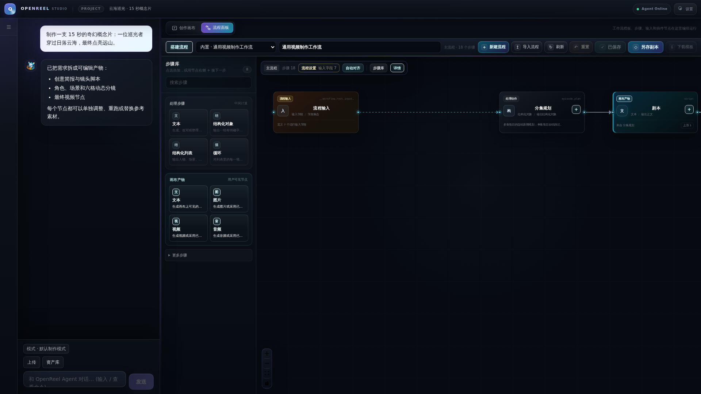
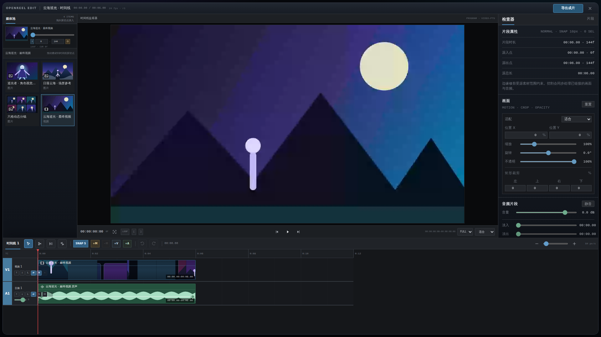

# OpenReel Studio

[English](./README.en.md) · 简体中文

[](https://github.com/yutianxiao6/openreel-studio/releases/latest)
[](https://github.com/yutianxiao6/openreel-studio/releases/latest)
[](https://www.npmjs.com/package/openreel-studio-installer)
[](./LICENSE)

**让 Agent、节点画布、可复用工作流与帧级时间线在同一个创作桌面协作。**

OpenReel Studio 是一个开源的聊天式 AI 视频创作工作台。你可以从一句自然语言需求开始，让 Agent 直接创建和运行文本、图片、视频、音频节点；也可以进入流程编辑器搭建可复用生产线，最后在内置时间线上完成剪辑与导出。

[快速开始](./docs/zh-CN/getting-started.md) · [使用指南](./docs/zh-CN/user-guide.md) · [工作流](./docs/zh-CN/workflows.md) · [项目结构](./docs/zh-CN/architecture.md)



## 为什么是 OpenReel Studio

AI 视频生产不只是生成一次图片或视频。真正困难的是让需求、剧本、参考图、提示词、模型参数、生成结果和剪辑版本保持一致，同时还能在失败时只重做必要的部分。

OpenReel Studio 用三个原则组织这条链路：

- **产物可见**：文本、图片、视频和音频都是画布上的真实节点，不藏在黑盒任务里。
- **依赖可追踪**：角色、场景、分镜和最终视频之间的参考关系通过连线表达。
- **步骤可重做**：单个节点可以编辑、运行、重试或替换，不必从头执行整条制作链。

## 一个工作台，四种协作方式

| 工作区 | 用途 |
| --- | --- |
| 项目会话 | 在左侧折叠栏中新建、切换、选择和管理项目，每个项目保留独立对话与画布。 |
| Agent 对话 | 用自然语言创建、修改、运行和复核节点；聊天区可以拖动调整宽度。 |
| 创作画布 | 查看和编辑真正交付的 `text`、`image`、`video`、`audio` 产物及其依赖。 |
| 流程与剪辑 | 在流程编辑器中复用生产方法，在帧级时间线中完成音画整理与成片导出。 |

## 从一句话到成片

1. **描述目标**：输入题材、时长、风格、画幅以及已有素材。
2. **生成可见产物**：Agent 创建剧本、角色、场景、分镜、视频或音频节点。
3. **检查并局部调整**：查看真实预览、提示词、参考来源和历史结果，只重跑需要修改的节点。
4. **复用制作方法**：把稳定步骤保存为工作流，通过输入、依赖、集合、条件和循环批量运行。
5. **进入时间线**：从媒体区把图片、视频和音频拖入轨道，完成排列、裁剪、音量和画面调整。
6. **导出回画布**：渲染结果会作为新的成片视频节点返回画布，继续参与后续制作。

## 核心能力

| 能力 | 当前实现 |
| --- | --- |
| 节点优先创作 | 以用户可见的文本、图片、视频和音频节点作为创作真相源。 |
| 真实视觉参考 | 区分提示词模型看图、媒体模型视觉参考和直接采用现有图片等引用角色。 |
| 生成与历史 | 支持节点独立运行、失败重试和历史结果恢复；失败不会覆盖最近一次成功预览。 |
| 工作流 V2 | 支持动态输入、`needs` 依赖、媒体 `uses`、集合展开、条件分支和有界反馈循环。 |
| 动态媒体设置 | 模型、比例、精确像素、画质和帧率由前端产物设置随本次运行传递，不污染可复用 Spec。 |
| 多模型接入 | 分别配置 LLM、图片、视频和音频服务，媒体 HTTP 协议使用声明式目录。 |
| 帧级视频剪辑 | 支持拖入素材、自动吸附、轨道排列、裁剪、分割、拼接、真实帧缩略图和音频波形。 |
| 画面与声音 | 支持位置、缩放、旋转、不透明度、矩形裁剪、音量、静音和淡入淡出。 |
| 本地与桌面运行 | 支持源码运行、Docker 部署以及 Windows、Linux、macOS 桌面安装包。 |
| 调试与可观测性 | 提供 Agent trace、工具结果、Token/缓存统计和诊断面板。 |

## 界面预览

以下截图来自当前版本的真实运行界面，演示内容为专门制作的公开示例。

### 可复用工作流

流程面板负责生产方法：搭建步骤、声明输入、连接依赖、配置动态产物并查看运行实例。创作画布仍只展示用户真正需要查看和交付的产物节点。



### 帧级视频时间线

内置剪辑器提供媒体池、画面监看、帧级轨道、真实波形、片段属性和导出。时间线导出后会在原画布创建新的成片节点。



## 适合谁

- 想把多种 AI 模型组合成稳定视频生产流程的创作者。
- 需要角色、场景、分镜和最终视频参考关系可追踪的短视频团队。
- 希望在本地或自有服务器管理模型配置、工作流和生成资产的用户。
- 研究 Agent 编排、Workflow V2 和节点式媒体生产的开发者。

OpenReel Studio 不内置模型额度。实际调用 LLM 或生成图片、视频、音频时，需要配置你自己的服务商账号和 API Key。

## 开始使用

- 桌面安装：前往 [最新 Release](https://github.com/yutianxiao6/openreel-studio/releases/latest) 下载当前平台安装包。
- 源码运行：阅读 [中文快速开始](./docs/zh-CN/getting-started.md)。
- 第一次使用：阅读 [中文使用指南](./docs/zh-CN/user-guide.md)。
- 模型配置：阅读 [模型接入](./docs/zh-CN/model-providers.md)。

安装器也可以自动下载当前平台的最新安装包：

```bash
npx openreel-studio-installer
```

## 文档

完整中文文档从 [docs/README.md](./docs/README.md) 开始，英文文档从 [docs/README.en.md](./docs/README.en.md) 开始。

| 主题 | 中文 | English |
| --- | --- | --- |
| 快速开始 | [打开](./docs/zh-CN/getting-started.md) | [Open](./docs/en/getting-started.md) |
| 使用指南 | [打开](./docs/zh-CN/user-guide.md) | [Open](./docs/en/user-guide.md) |
| 项目结构 | [打开](./docs/zh-CN/architecture.md) | [Open](./docs/en/architecture.md) |
| 工作流 | [打开](./docs/zh-CN/workflows.md) | [Open](./docs/en/workflows.md) |
| 模型接入 | [打开](./docs/zh-CN/model-providers.md) | [Open](./docs/en/model-providers.md) |
| 开发与测试 | [打开](./docs/zh-CN/development.md) | [Open](./docs/en/development.md) |

## 开源仓库边界

仓库只保存代码、默认协议、内置 Skill、工作流模板和公开文档。以下内容不应提交：

- `.env`、API Key、访问令牌和私有证书；
- `data/`、`storage/` 中的运行数据库、生成资产、trace 和用户内容；
- 本地模型配置、私人工作流、构建产物和临时截图；
- 含有第三方隐私信息或无再分发权利的素材。

发现安全问题时，请不要在公开 Issue 中粘贴密钥、完整配置或用户数据。

## 项目状态

项目仍在持续开发，工作流协议、模型适配、桌面打包和剪辑器会继续迭代。用于正式生产前，请先在你的模型服务、素材格式和部署环境中完成验证。

## License

[MIT](./LICENSE)
