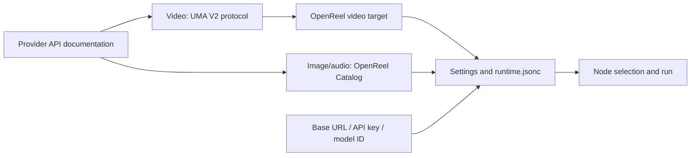
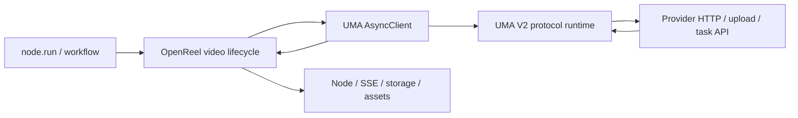

# Model configuration and provider protocols

English · [简体中文](../zh-CN/model-providers.md) · [Documentation home](../README.en.md) · [User guide](./user-guide.md)

This guide covers the OpenReel settings and runtime boundary. Detailed video
wire-protocol authoring belongs to the Universal Model Adapter submodule and is
documented in its [OpenReel video integration guide](https://github.com/yutianxiao6/universal-model-adapter/blob/main/docs/OPENREEL_INTEGRATION.md).

## Choose the correct configuration path

| Situation | Action |
| --- | --- |
| Configure an Agent LLM | Add it under **Settings → LLM models**. |
| Configure a built-in video target | Add a Video Provider and select its UMA protocol and recommended target. |
| Add a video API with a different wire contract | Add an `uma.protocol/v2` document and an OpenReel video target, following the submodule guide. |
| Configure an existing image or audio protocol | Add the Provider in the corresponding Settings tab. |
| Add a new image or audio HTTP contract | Extend the corresponding OpenReel Catalog. |

Matching model names do not prove that two APIs share a wire protocol. Compare
the provider method, path, authentication, request body, upload flow, task
statuses, and result fields.

## Configuration truth sources



| Source | Purpose |
| --- | --- |
| `config/runtime.jsonc` | Local accounts, Base URLs, API keys, model IDs, enabled/default state, and protocol/target references. |
| `config/universal_model_adapter/protocols/*.json` | Video HTTP, authentication, upload, provider task polling, status/error interpretation, and artifact extraction. |
| `config/universal_model_adapter/video_targets/catalog.json` | Video model matching, UI labels, modes, media limits, ratios, resolutions, durations, defaults, and extra Base URL slots. |
| `config/image_provider_protocols/catalog.json` | Current OpenReel image HTTP contracts. |
| `config/audio_provider_protocols/catalog.json` | Current OpenReel audio HTTP contracts. |

Video Providers must use `api_format=universal_adapter` and explicitly reference
both `params.uma.protocol_id` and `params.uma.target_profile_id`. OpenReel does
not infer either value from the model name. Image and audio may continue using
their current host Catalog formats.

A Workflow V2 Spec describes reusable inputs, steps, and dependencies. It does
not store provider credentials or deployment-specific account selection.

## Configure an LLM

Open **Settings → LLM models**. LLMs power Agent chat, reasoning, prompt
preparation, review, and context compaction; they do not generate media.


1. Add a Provider to the Strong, Balanced, or Small tier.
2. Enter a unique local name, LiteLLM provider prefix, exact model ID, Base URL,
   and API key.
3. Enter the real context window, maximum input, and maximum output limits.
4. Mark Prompt Cache and vision support only when the endpoint supports them.
5. Keep the Provider enabled and select a tier default where needed.

If the model ID already contains a provider prefix such as `openai/gpt-4.1`,
OpenReel does not prepend the prefix again.

## Configure a media Provider

Image, video, and audio accounts are independent.


1. Open the corresponding media Provider tab and select **Add Provider**.
2. Enter a unique name, versioned API Base URL, exact remote model ID, and API
   key.
3. For video, select one UMA protocol and its exact model target. For image or
   audio, select the matching OpenReel Catalog protocol.
4. Configure required secondary Base URLs when the selected target or protocol
   declares them.
5. Choose Default and Enabled as needed, then save.
6. Select the Provider on a node and make the smallest supported real request.

Saving proves local schema validation only. A minimal node run is the
end-to-end connection test.

### Base URL

The Provider Base URL is the versioned API root. The protocol owns the resource
path:

```text
Base URL:      https://relay.example.test/v1
Protocol path: /videos/generations
Final URL:     https://relay.example.test/v1/videos/generations
```

Do not put a complete generation endpoint in the Base URL. Additional upload or
poll hosts use named Base URL slots exposed by the selected target.

## Video uses the UMA submodule exclusively

OpenReel pins the `vendor/universal-model-adapter` submodule. The production
boundary is:



OpenReel owns provider selection, node/task lifecycle, background scheduling,
SSE, persisted resume data, local materialization, assets, and stale-job
protection. UMA owns request construction, authentication, media upload,
provider task-ID extraction, upstream polling, exact status/error
interpretation, artifact extraction, and normalized results.

OpenReel maps normalized `InvocationResult` and `VideoOutput` values into node
fields. It does not inspect provider JSON or keep video `status_path`, task-ID
path, or result-URL parsing code.

### Runtime video example

```jsonc
{
  "kind": "video",
  "name": "seedance-production",
  "base_url": "https://ark.cn-beijing.volces.com/api/v3",
  "api_key": "${VIDEO_API_KEY}",
  "model_name": "doubao-seedance-2-0-260128",
  "api_format": "universal_adapter",
  "is_active": true,
  "enabled": true,
  "params": {
    "uma": {
      "protocol_id": "volcengine.seedance-video-task",
      "operation": "video.generate",
      "target_profile_id": "volcengine.seedance-video-task:doubao-seedance-2-0-260128"
    }
  }
}
```

Runtime configuration never embeds protocol documents or response paths.

### Restart recovery

OpenReel persists the UMA invocation ID, provider task ID, and a credential-free
normalized request after provider acceptance. On restart it calls UMA
`resume_task(request, provider_task_id)`. UMA skips submission and resumes the
protocol-owned poll operation, so the provider task is not billed twice.

UMA live handles and event replay remain in memory; OpenReel is responsible for
durable node/job state and restart discovery.

### Detailed video protocol guide

Use the submodule guide for:

- `uma.protocol/v2` schema and JSON Pointer mapping;
- JSON/form/multipart/raw request construction;
- upload-first media preparation;
- submit, poll, cancel, status, error, and artifact mappings;
- OpenReel video target capabilities and media roles;
- host-supplied restart recovery;
- validation commands, contract tests, and troubleshooting ownership.

Source of truth: [Universal Model Adapter — OpenReel video integration guide](https://github.com/yutianxiao6/universal-model-adapter/blob/main/docs/OPENREEL_INTEGRATION.md).

## Image and audio Catalogs

Image and audio have not yet been hard-migrated to UMA. Their current
declarative contracts remain in:

```text
config/image_provider_protocols/catalog.json
config/audio_provider_protocols/catalog.json
```

The Catalog root and each entry use the media-specific OpenReel v1 schema. A
Provider stores `params.image_protocol_id` or `params.audio_protocol_id`. The
Catalog owns request, optional polling, result extraction, and optional upload
rules. It must never contain real credentials.

Deployments may override these files with `OPENREEL_IMAGE_PROTOCOLS_FILE` and
`OPENREEL_AUDIO_PROTOCOLS_FILE`. Video protocol discovery uses the UMA paths and
optional `OPENREEL_UMA_PROTOCOLS` path list.

After editing an image/audio Catalog, refresh Settings and run one minimal node.
For video, validate the UMA protocol directory before refreshing:

```bash
cd apps/api
uv run uma protocols validate ../../config/universal_model_adapter/protocols
```

## Troubleshooting

| Symptom | Check first |
| --- | --- |
| Video save is disabled | `api_format`, Base URL, model ID, API key, explicit `protocol_id`, exact `target_profile_id`, and required secondary Base URLs. |
| Video protocol or target is absent | UMA protocol JSON, video target catalog, protocol/target ID match, and `OPENREEL_UMA_PROTOCOLS`. |
| Video mode or media is rejected before HTTP | Target modes, accepted roles, counts, duration, ratio, and resolution. |
| Video request, polling status, or result is wrong | UMA V2 protocol document; do not add parsing to OpenReel. |
| Video does not resume after restart | Persisted provider task ID, resume request, provider selection, and OpenReel recovery logs. |
| Image/audio protocol is absent | Corresponding host Catalog path, JSON syntax/version, ID, and environment override. |
| 401 / 403 | API key, authentication contract, and Base URL account ownership. |
| 404 | Base URL version and duplicated or missing protocol resource path. |
| 400 / 422 | Remote model ID, mode, fields, duration, ratio, resolution, and media count. |

Repair the configuration and rerun the original node. A failed attempt keeps
the latest successful preview.

## Security

- Use Settings only on trusted devices and authenticated deployments.
- Never commit `runtime.jsonc`, `.env`, API keys, complete private headers,
  provider responses, or user media.
- Protocol and target files may be committed only when examples and fixtures
  are sanitized and redistributable.
- Keep credentials in runtime configuration, environment variables, or
  deployment Secret storage—not in protocol JSON.
