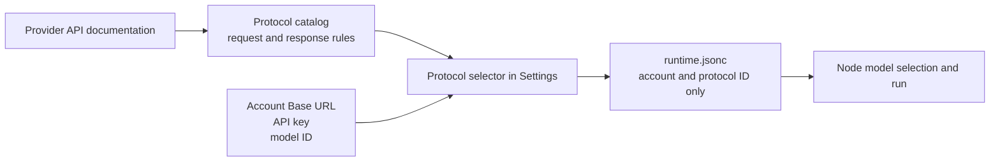
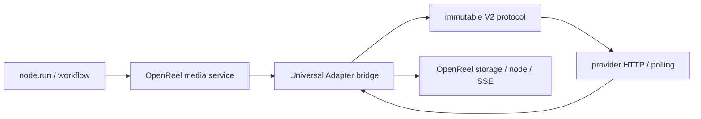

# Model configuration and provider protocols

English · [简体中文](../zh-CN/model-providers.md) · [Documentation home](../README.en.md) · [User guide](./user-guide.md)

This guide is for creators and operators who need to use OpenReel Studio. Most users only configure an account in Settings. Write a protocol file only when the provider HTTP API is incompatible with every built-in protocol.

## Choose the correct path

| Situation | Action |
| --- | --- |
| Configure an LLM | Add it directly under **Settings → LLM models**. |
| An image, video, or audio API already appears in the protocol selector | Enter the account and model information in the corresponding Provider tab. |
| The model ID differs but its HTTP contract exactly matches an existing protocol | Reuse that protocol and enter the real provider model ID. |
| Submission, authentication, payload, polling, or result fields differ | Add a protocol to `config/*_provider_protocols/catalog.json`, then select it in Settings. |

Matching model names do not prove that two APIs share a protocol. Compare the provider documentation for method, path, authentication, payload, asynchronous states, and output fields.

## Two configuration layers



- `config/runtime.jsonc` is local runtime configuration. It contains accounts, base URLs, API keys, model IDs, enabled state, and protocol IDs.
- `config/image_provider_protocols/catalog.json`, `video_provider_protocols/catalog.json`, and `audio_provider_protocols/catalog.json` contain reusable HTTP adaptation rules.
- Provider `params` reference only `image_protocol_id`, `video_protocol_id`, or `audio_protocol_id`. They cannot embed a private protocol object.
- A Workflow V2 Spec describes inputs, steps, and dependencies. Model IDs, aspect ratio, resolution, and provider credentials come from frontend artifact settings and runtime configuration, not the reusable Workflow Spec.

## Configure an LLM in Settings

Open **Settings** in the upper-right corner. The LLM page is separate from image, video, and audio providers; configuring an LLM does not add media generation.


### Model tiers

| Tier | Main use | Recommendation |
| --- | --- | --- |
| Strong | Main Agent, complex creation, long context, and difficult reasoning | Use the most capable model with an appropriate context window. |
| Balanced | Routine production, image prompts, and general workers | Balance quality, latency, and cost. |
| Small | Review, summaries, and lightweight helper calls | Prefer a fast and inexpensive model. |

Each tier may contain several Providers and one tier default. Tasks without an explicit assignment use the default Provider for their tier.

### Steps

1. Select **Add** in the desired tier.
2. Enter a name, Provider prefix, model ID, Base URL, and API key.
3. Enter the real context window, maximum input, and maximum output supported by the provider.
4. Mark Prompt Cache and vision support only when the provider actually supports them.
5. Keep the Provider enabled and save it.
6. If the tier has multiple entries, select **Set as tier default**.

### LLM fields

| Field | Value |
| --- | --- |
| Name | A unique local name such as `studio-strong`. Task assignments reference this name. |
| Strategy tier | `strong`, `balanced`, or `small`. |
| Provider prefix | A LiteLLM Provider such as `openai`, `anthropic`, `deepseek`, `dashscope`, or `gemini`. |
| Model ID | The provider model ID, such as `gpt-4.1`. If it already contains `/`, the backend does not prepend the Provider again. |
| Base URL | Currently required by the frontend. Enter the provider or relay API root, not the complete chat-completions resource path. |
| Context window | Total context capacity used for context and compaction monitoring. |
| Maximum input | Provider input limit; it cannot exceed the context window. |
| Maximum output | Default output limit; it cannot exceed the context window. An omitted value defaults to 4000. |
| Prompt Cache | Used only for truthful cache capability and metrics. |
| Vision input | Whether the chat endpoint accepts `image_url`. Image items are removed for a model marked unsupported. |
| API key | The local account secret, displayed in a password input. |

For example, `openai/gpt-4.1` may remain the model ID while the Provider prefix is `openai`; it will not become `openai/openai/gpt-4.1`.

## Configure a media Provider in Settings

Image, video, and audio Providers are managed independently. The screenshot uses video, but image and audio follow the same sequence.


### Steps

1. Open **Settings → Image Provider / Video Provider / Audio Provider**.
2. Select **Add Provider**.
3. Enter a recognizable local name.
4. Enter a versioned or namespaced **API Base URL**.
5. Enter the exact model ID accepted by the provider. The Video page can also use a recommended model supplied by `model_profiles`.
6. Select the protocol whose HTTP contract matches the provider.
7. Enter the API key, choose Default and Enabled as needed, then save.
8. Open a node of that media type, confirm that the Provider appears in its model selector, and make one minimal real request.

Settings currently has no separate connection-test button. Saving proves that local schema validation passed, not that an external provider accepted a request. A minimal node run is the end-to-end test.

### Media fields

| Field | Value |
| --- | --- |
| Name | Unique within one media kind, for example `seedance-production`. |
| API Base URL | A versioned API root such as `https://api.example.test/v1` or `https://ark.example.test/api/v3`. |
| Recommended model | Dynamically built from video `model_profiles`; it fills only the model ID and protocol ID. |
| Model ID | The exact ID accepted by the official API or relay. Do not infer it from a display label. |
| Image/video/audio protocol | Dynamically loaded from the corresponding Catalog and used for request, polling, and result parsing. |
| API key | A key issued for the same service or relay as the Base URL. |
| Default | At most one default per media kind; it is used when a node does not explicitly select a model. |
| Enabled | Disabled entries should not appear in normal node model selection. |

### Base URL contract

The backend treats the Base URL literally and appends the resource path from the protocol:

```text
Base URL:     https://relay.example.test/v1
Protocol path: /videos/generations
Final URL:    https://relay.example.test/v1/videos/generations
```

Do not enter a bare host or a complete endpoint:

```text
Wrong:   https://relay.example.test
Wrong:   https://relay.example.test/v1/videos/generations
Correct: https://relay.example.test/v1
```

Protocol paths contain resources such as `/images/generations`, `/videos`, and `/audio/speech`. They do not repeat `/v1`, `/v2`, or `/api/v3`.

### Image transport in Advanced Settings

- `data_url` is the default. Local project images become Base64/data URLs; existing public URLs remain URLs.
- Use `public_url` when a provider accepts only public image addresses, and set a Public Base URL that exposes project `/api/media/...` resources.
- Video and audio references are commonly URL-based as well. A provider cannot read localhost or a private network URL unless the media is uploaded or publicly exposed.
- When a protocol section declares `base_url_param`, Settings automatically adds the required secondary Base URL field.

## Universal Model Adapter

OpenReel pins `universal-model-adapter` as the `vendor/universal-model-adapter` submodule. Nodes and workflows still call OpenReel image, video, and audio generation services. The service bridge translates each request into an adapter invocation, then writes normalized progress, errors, and media outputs back through the existing node, storage, and canvas-event paths.



The ownership boundary stays explicit:

- OpenReel owns projects, nodes, workflows, account configuration, asset persistence, and canvas refresh.
- The adapter owns capability validation, request construction, authentication, upload, polling, exact result parsing, normalized errors, and cancellation.
- `runtime.jsonc` contains account, remote-model, and target configuration. It never embeds a V2 protocol document.
- Agent LLM calls still use LiteLLM because the OpenReel Agent Loop depends on its synchronous tool-call contract. This integration covers image, video, and audio generation.

### Bundled V2 protocols

| Protocol ID | Operations currently usable by OpenReel |
| --- | --- |
| `openai.media` | `image.generate`, `audio.speech` |
| `stability.stable-image-core` | `image.generate` |
| `elevenlabs.text-to-speech` | `audio.speech` |
| `runway.video-task` | `video.generate` |

Bundled protocols come from the submodule's `protocols/common/` directory. Put custom V2 protocols in `config/universal_model_adapter/protocols/*.json`, or point `OPENREEL_UMA_PROTOCOLS` at additional files/directories. Separate multiple paths with the platform path separator. A protocol file revision creates a fresh client binding on the next request.

The media Settings UI preserves existing `universal_adapter` Providers. For now, add a new adapter Provider in **Settings → Configuration file** or directly in `config/runtime.jsonc`; the existing image/video/audio protocol selectors continue to manage legacy `*_http_v1` Catalogs.

### Provider configuration

```jsonc
{
  "kind": "image",
  "name": "openai-image-via-uma",
  "base_url": "https://api.openai.com/v1",
  "api_key": "${OPENAI_API_KEY}",
  "model_name": "gpt-image-1",
  "api_format": "universal_adapter",
  "is_active": true,
  "enabled": true,
  "params": {
    "uma": {
      "protocol_id": "openai.media",
      "operation": "image.generate",
      "target_defaults": {
        "parameters": {"output_format": "png"}
      }
    }
  }
}
```

Common `params.uma` fields:

| Field | Purpose |
| --- | --- |
| `protocol_id` | Required reference to an installed V2 protocol ID. |
| `operation` | Optional; defaults to `image.generate`, `video.generate`, or `audio.speech` for the media kind. |
| `target_defaults` / `request_schema` / `variants` | Capability, defaults, and variants for this concrete remote model. These belong to target configuration. |
| `input_map` / `parameter_map` | Explicitly map OpenReel normalized fields when the target operation uses different names. |
| `static_input` / `static_parameters` | Inputs or parameters fixed for this remote model. |
| `accepted_media_roles` | Declares media roles the target really accepts, such as `first_frame`, `last_frame`, or `reference_image`. Media without a declaration fails before provider I/O instead of being silently dropped. |
| `bases` / `headers` / `provider_parameters` | Additional connection slots, static headers, and connection-layer parameters. Real credentials remain in top-level `api_key`. |
| `poll_*` / `task_timeout_seconds` | Adapter polling cadence and total task timeout. |

Protocol and user configuration remain separate. The schema rejects `protocol`, `protocol_document`, and `operations` inside `params.uma`.

For audio APIs with different normalized field names, map the field and provide target defaults explicitly:

```jsonc
"params": {
  "uma": {
    "protocol_id": "openai.media",
    "operation": "audio.speech",
    "parameter_map": {"format": "response_format"},
    "static_parameters": {"voice": "alloy", "response_format": "mp3"}
  }
}
```

The adapter currently keeps active invocation handles in the API process. OpenReel marks adapter jobs as non-resumable across restarts; after a restart it safely settles the node as failed and asks for a manual retry instead of automatically resubmitting a potentially billable request. Legacy `*_http_v1` Providers retain their existing persisted polling recovery.

## Write a media protocol

### Files and versions

| Kind | Catalog version | Entry version |
| --- | --- | --- |
| Image | `openreel.image_provider_catalog.v1` | `openreel.image_provider.v1` |
| Video | `openreel.video_provider_catalog.v1` | `openreel.video_provider.v1` |
| Audio | `openreel.audio_provider_catalog.v1` | `openreel.audio_provider.v1` |

```text
config/
  image_provider_protocols/catalog.json
  video_provider_protocols/catalog.json
  audio_provider_protocols/catalog.json
```

Catalog files are strict JSON and do not accept comments. The root object contains `version` and `protocols`; use a map keyed by protocol ID. The map key, entry `id`, and Provider `*_protocol_id` must match exactly.

A deployment may override the default files with `OPENREEL_IMAGE_PROTOCOLS_FILE`, `OPENREEL_VIDEO_PROTOCOLS_FILE`, or `OPENREEL_AUDIO_PROTOCOLS_FILE`. Edit the referenced file when an override is active.

### Common fields

| Field | Purpose |
| --- | --- |
| `version` | Entry version for the media kind. |
| `id` | Stable protocol ID matching the map key. |
| `display_name` | Label shown in the Settings protocol selector. |
| `default_base_url` | Documentation/default value; the Provider Base URL takes priority. |
| `default_params` | Protocol request defaults. |
| `model_profiles` | Per-model defaults and supported ratios, resolutions, or modes. |
| `request` | Submission method, resource path, authentication, request template, and task-ID paths. |
| `poll` | Poll method/path, status field, terminal states, interval, and timeout. |
| `result` | Image, video, or audio extraction paths. |
| `upload` | Optional upload-first phase. |

Supported authentication values include:

- `"auth": "bearer"` sends `Authorization: Bearer <API Key>`.
- `"auth": "api_key_header"` with `"api_key_header": "X-API-Key"` sends the key in that header.
- `"auth": "raw"` sends the API key directly as `Authorization`.

Never put real secrets in static Catalog `headers`. Catalogs can be committed; secrets belong in `runtime.jsonc`, environment variables, or deployment Secret storage.

### Request placeholders

`request.body` recursively renders `$variable` placeholders. Empty values are omitted while `false` and `0` are preserved.

| Kind | Common variables |
| --- | --- |
| General | `$model`, `$prompt` |
| Image | `$size`, `$quality`, `$count`, `$negative_prompt`, `$response_format`, `$reference_image_input`, `$reference_images` |
| Video | `$content`, `$duration_seconds`, `$aspect_ratio`, `$resolution`, `$mode`, `$image_urls`, `$first_image_url`, `$video_urls`, `$audio_urls`, `$generate_audio`, `$watermark` |
| Audio | `$input`, `$text`, `$voice`, `$response_format`, `$speed`, `$instructions`, `$title`, `$style`, `$instrumental` |

Response paths use dots and list indexes, for example `data.task.id` and `data.0.url`. Provide the most accurate path first and optional fallbacks after it.

### Minimal image protocol

This example handles a synchronous OpenAI-compatible response containing a URL or Base64 image:

```json
{
  "version": "openreel.image_provider_catalog.v1",
  "protocols": {
    "example_images": {
      "version": "openreel.image_provider.v1",
      "id": "example_images",
      "display_name": "Example images API",
      "default_base_url": "https://api.example.test/v1",
      "default_params": { "size": "1024x1024" },
      "model_profiles": [
        { "match": "example-image-model", "default_params": { "size": "1024x1024" } }
      ],
      "request": {
        "method": "POST",
        "path": "/images/generations",
        "auth": "bearer",
        "merge_extra": true,
        "body": {
          "model": "$model",
          "prompt": "$prompt",
          "n": "$count",
          "size": "$size",
          "quality": "$quality",
          "image": "$reference_image_input"
        }
      },
      "result": {
        "images_path": "data",
        "url_path": "url",
        "b64_path": "b64_json",
        "image_url_paths": ["data.0.url", "images.0.url", "url"],
        "b64_paths": ["data.0.b64_json", "b64_json"]
      }
    }
  }
}
```

For an asynchronous image API, add `request.task_id_paths`, `poll`, and result paths in the same way as a video task.

### Complete asynchronous video example

Assume creation returns `{"data":{"id":"job_123"}}` and polling returns `{"data":{"status":"succeeded","video_url":"https://..."}}`:

```json
{
  "version": "openreel.video_provider_catalog.v1",
  "protocols": {
    "example_video_task": {
      "version": "openreel.video_provider.v1",
      "id": "example_video_task",
      "display_name": "Example async video",
      "default_base_url": "https://api.example.test/v1",
      "image_transport": "data_url",
      "supported_ratios": ["16:9", "9:16", "1:1"],
      "duration": { "min": 5, "max": 10 },
      "model_profiles": [
        {
          "match": "example-video-model",
          "label": "Standard",
          "supported_resolutions": ["720p", "1080p"],
          "default_resolution": "720p"
        }
      ],
      "modes": {
        "text_to_video": {
          "label": "Text to video",
          "prompt_required": true,
          "max_images": 0,
          "max_videos": 0,
          "max_audios": 0
        },
        "first_frame": {
          "label": "First frame to video",
          "prompt_required": true,
          "required_roles": ["first_frame"],
          "allowed_roles": ["first_frame"],
          "min_images": 1,
          "max_images": 1
        }
      },
      "request": {
        "method": "POST",
        "path": "/videos/generations",
        "auth": "bearer",
        "task_id_paths": ["data.id", "id"],
        "body": {
          "model": "$model",
          "prompt": "$prompt",
          "image": "$first_image_url",
          "duration": "$duration_seconds",
          "aspect_ratio": "$aspect_ratio",
          "resolution": "$resolution"
        }
      },
      "poll": {
        "method": "GET",
        "path": "/videos/generations/{task_id}",
        "status_path": "data.status",
        "succeeded": ["succeeded"],
        "failed": ["failed", "cancelled", "expired"],
        "running": ["queued", "running", "processing"],
        "interval_seconds": 10,
        "timeout_seconds": 1200
      },
      "result": {
        "video_url_paths": ["data.video_url", "video_url", "url"]
      }
    }
  }
}
```

Declare capabilities at protocol, `model_profiles`, or individual `modes` level. The frontend exposes only supported ratios, resolutions, and modes. Do not hardcode these values in a Workflow Spec.

When an upload API uses a different version, declare a secondary Base URL:

```json
{
  "upload": {
    "method": "POST",
    "base_url_param": "upload_base_url",
    "base_url_label": "Upload API Base URL",
    "base_url_hint": "Enter the versioned API root used for file uploads",
    "path": "/files",
    "auth": "bearer"
  }
}
```

Settings then requires `params.upload_base_url` when the Provider is saved.

### Minimal audio protocol

Use a binary result for a synchronous speech endpoint:

```json
{
  "version": "openreel.audio_provider_catalog.v1",
  "protocols": {
    "example_audio_speech": {
      "version": "openreel.audio_provider.v1",
      "id": "example_audio_speech",
      "display_name": "Example audio speech",
      "default_base_url": "https://api.example.test/v1",
      "default_params": { "voice": "alloy", "response_format": "mp3" },
      "model_profiles": [{ "match": "example-tts-model" }],
      "request": {
        "method": "POST",
        "path": "/audio/speech",
        "auth": "bearer",
        "required_context": ["input"],
        "body": {
          "model": "$model",
          "input": "$input",
          "voice": "$voice",
          "response_format": "$response_format",
          "speed": "$speed"
        }
      },
      "result": { "type": "binary", "format_param": "response_format" }
    }
  }
}
```

For a URL or asynchronous audio result, configure URL result paths or add `request.task_id_paths`, `poll`, and status groups.

## Use a new protocol from the frontend

1. Add the protocol to the correct `catalog.json` and keep it valid JSON.
2. Verify the Catalog version, entry version, and key/`id` match.
3. Open Settings and select **Refresh**. The backend reads Catalogs dynamically, so a restart is normally unnecessary.
4. Add a Provider in the corresponding media tab.
5. Enter Base URL, model ID, and API key, then select the new protocol.
6. Save, create a minimal node, select the Provider, and run only parameters that the provider explicitly supports.
7. Add references, longer durations, high resolution, and workflow batches only after the minimal request succeeds.

The **Configuration file** tab edits `runtime.jsonc`, not protocol Catalogs. It is useful for account batches and `${ENV_VAR}` references, but it cannot define a new protocol.

## File configuration example

Prefer the frontend for normal use. For deployment secrets or bulk configuration, copy `config/runtime.example.jsonc` and use an environment variable:

```jsonc
{
  "$schema_version": 1,
  "llm_providers": [],
  "media_providers": [
    {
      "kind": "video",
      "name": "example-video",
      "base_url": "https://api.example.test/v1",
      "api_key": "${VIDEO_API_KEY}",
      "model_name": "example-video-model",
      "api_format": "video_http_v1",
      "is_active": true,
      "enabled": true,
      "notes": "",
      "params": {
        "video_protocol_id": "example_video_task",
        "image_transport": "data_url"
      }
    }
  ],
  "model_tier_defaults": { "strong": null, "balanced": null, "small": null },
  "model_assignments": {},
  "app_settings": {}
}
```

`runtime.jsonc` accepts comments; Catalog files are strict JSON. A failed runtime validation leaves the previously active configuration intact.

## Minimal validation and troubleshooting

### Validation order

1. Save and enable the Provider.
2. Confirm that it appears in a node model selector.
3. Test image generation with one short prompt and the protocol default size.
4. Test video with the shortest supported duration, default resolution, and text-to-video mode before adding references.
5. Test audio with short input and default voice/format.
6. Read the endpoint, HTTP status, provider summary, and task ID from the node error.

### Common failures

| Symptom | Check first |
| --- | --- |
| Save is disabled | Missing name, Base URL, model ID, API key, protocol ID, or required secondary Base URL. |
| Protocol is absent | Catalog path, JSON syntax, Catalog version, key/`id`, or an environment override pointing elsewhere. |
| 401 / 403 | API key, authentication mode, and whether the key belongs to this Base URL. |
| 404 | Missing Base URL version or a protocol path that duplicates `/v1`, `/v2`, or `/api/v3`. |
| 400 / 422 | Request field names, model ID, mode, ratio, duration, resolution, and media count. |
| Creation succeeds without a task ID | `request.task_id_paths` does not match the creation response. |
| Polling never finishes | `poll.path`, `status_path`, or running/succeeded/failed values do not match. |
| Success has no media | Result URL/Base64 path or binary result type does not match. |
| Local references cannot be sent | `image_transport`, `public_base_url`, data-URL support, or a required upload phase. |
| `bad response body` | The provider response shape differs from protocol extraction rules. |

Repair the configuration and rerun the original node. A failed attempt retains the latest successful node preview.

## Security

- Settings writes account configuration to local `config/runtime.jsonc`; use it only on trusted devices and protected Studio deployments.
- Add authentication before exposing a Studio deployment to the public internet.
- Never commit `runtime.jsonc`, `.env`, real API keys, complete request headers, private provider responses, or user media.
- Committed protocol examples use `example.test`, placeholder model IDs, and environment variables.
- A protocol contributed to the repository should include endpoint, payload, polling, result, error-state, and Base URL contract tests.
