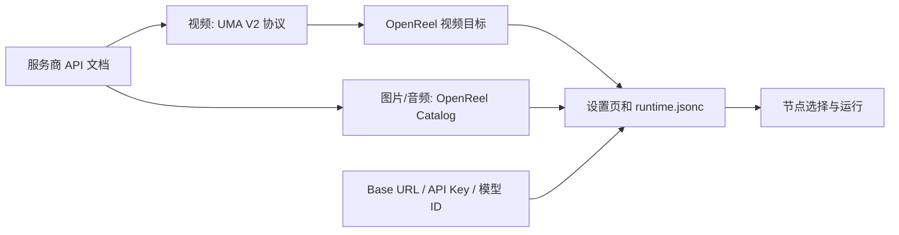
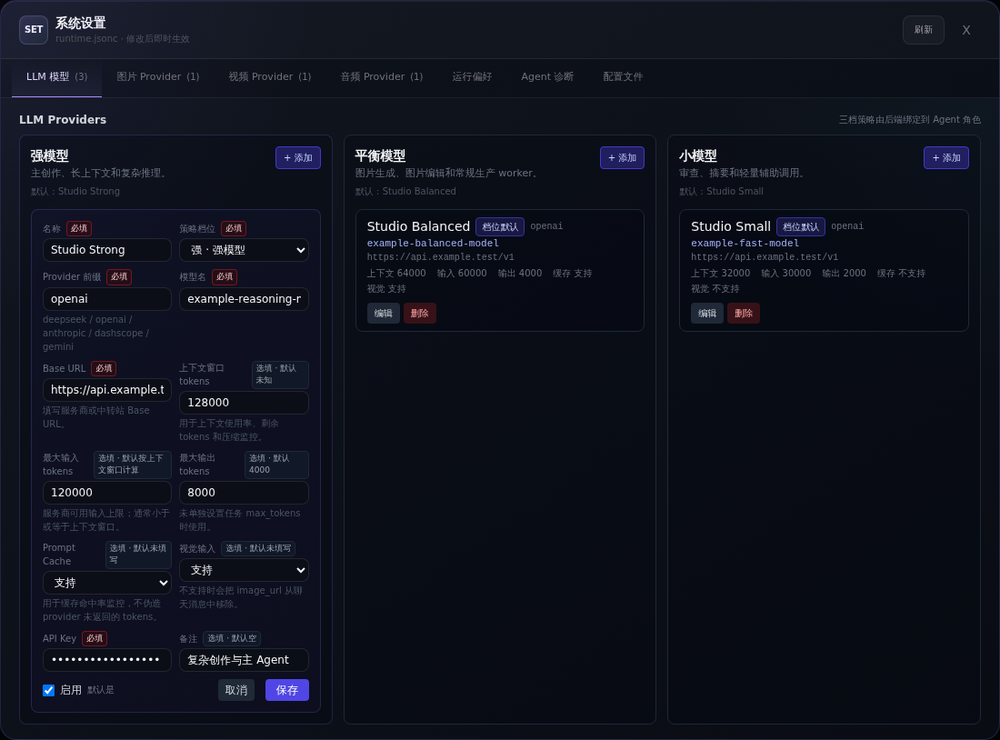
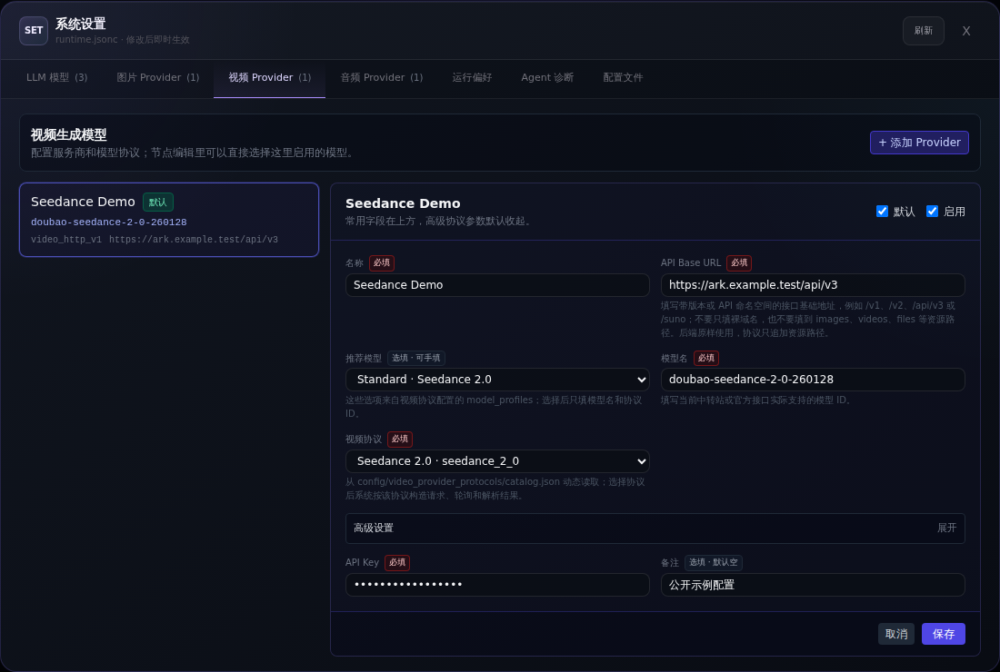
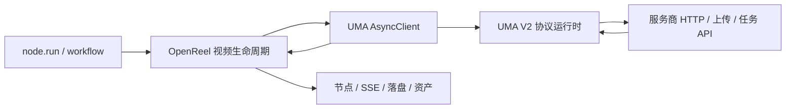

# 模型配置与协议接入

[English](../en/model-providers.md) · [中文文档首页](../README.md) · [使用指南](./user-guide.md)

本文只说明 OpenReel 的设置页和运行时边界。视频线协议的详细写法统一由
Universal Model Adapter 子仓维护，请阅读子仓的
[OpenReel 视频集成指南](https://github.com/yutianxiao6/universal-model-adapter/blob/main/docs/OPENREEL_INTEGRATION.md)。

## 先选择正确的配置路径

| 你的情况 | 应该怎么做 |
| --- | --- |
| 配置 Agent 使用的 LLM | 在“设置 → LLM 模型”添加。 |
| 配置已有的视频目标 | 添加视频 Provider，选择对应 UMA 协议和推荐目标。 |
| 视频 API 的 HTTP 合同与现有协议不同 | 按子仓指南新增 `uma.protocol/v2` 文档和 OpenReel 视频目标。 |
| 配置已有图片或音频协议 | 在对应设置页添加 Provider。 |
| 新增图片或音频 HTTP 合同 | 扩展对应的 OpenReel Catalog。 |

模型名相同不代表线协议相同。复用协议前应核对 HTTP 方法、路径、鉴权、
请求体、上传流程、异步任务状态和结果字段。

## 配置真相源



| 真相源 | 作用 |
| --- | --- |
| `config/runtime.jsonc` | 本机账号、Base URL、API Key、模型 ID、启用/默认状态以及协议和目标引用。 |
| `config/universal_model_adapter/protocols/*.json` | 视频 HTTP、鉴权、上传、上游任务轮询、状态/错误判断和产物提取。 |
| `config/universal_model_adapter/video_targets/catalog.json` | 视频模型匹配、前端名称、模式、参考素材限制、比例、分辨率、时长、默认值和额外 Base URL 槽位。 |
| `config/image_provider_protocols/catalog.json` | 当前 OpenReel 图片 HTTP 合同。 |
| `config/audio_provider_protocols/catalog.json` | 当前 OpenReel 音频 HTTP 合同。 |

所有视频 Provider 必须使用 `api_format=universal_adapter`，并显式引用
`params.uma.protocol_id` 和 `params.uma.target_profile_id`。OpenReel 不根据
模型名推断协议或目标。图片和音频暂时继续支持现有宿主 Catalog。

Workflow V2 Spec 只描述可复用输入、步骤和依赖，不保存 Provider 密钥或
部署环境的账号选择。

## 配置 LLM

打开“设置 → LLM 模型”。LLM 用于 Agent 对话、推理、提示词准备、评审和
上下文压缩，不负责直接生成媒体。



1. 在强、平衡或小模型档位添加 Provider。
2. 填写本地唯一名称、LiteLLM Provider 前缀、准确模型 ID、Base URL 和 API Key。
3. 按服务商真实限制填写上下文窗口、最大输入和最大输出。
4. 只有接口真实支持时才启用 Prompt Cache 和视觉输入。
5. 保持 Provider 启用，并按需设置档位默认。

模型 ID 已包含 `openai/gpt-4.1` 这类前缀时，OpenReel 不会再次拼接。

## 配置媒体 Provider

图片、视频和音频账号彼此独立。



1. 打开对应媒体 Provider 页面，点击“添加 Provider”。
2. 填写唯一名称、带版本的 API Base URL、服务商准确模型 ID 和 API Key。
3. 视频选择一个 UMA 协议及其准确模型目标；图片或音频选择对应 OpenReel
   Catalog 协议。
4. 选中的目标或协议声明额外 Base URL 时，补齐对应槽位。
5. 按需设置“默认”和“启用”，然后保存。
6. 在节点上选择该 Provider，用服务商支持的最小参数做一次真实调用。

保存只代表本地 schema 校验通过；最小节点运行才是端到端连接测试。

### Base URL

Provider Base URL 是带版本的 API 根地址，资源路径由协议负责：

```text
Base URL:  https://relay.example.test/v1
协议 path: /videos/generations
最终地址:  https://relay.example.test/v1/videos/generations
```

不要把完整生成接口填进 Base URL。上传或轮询使用另一主机时，由选中的目标
暴露命名 Base URL 槽位。

## 视频统一使用 UMA 子仓

OpenReel 固定引用 `vendor/universal-model-adapter` 子仓。生产边界如下：



OpenReel 负责 Provider 选择、节点/任务生命周期、后台调度、SSE、持久化恢复
信息、本地落盘、资产和旧任务覆盖保护。UMA 负责请求拼装、鉴权、素材上传、
provider task ID 提取、上游轮询、精确状态/错误解释、产物提取和标准化结果。

OpenReel 只把标准化 `InvocationResult` 和 `VideoOutput` 转换成节点字段，
不读取 provider JSON，也不保留视频 `status_path`、task ID 路径或结果 URL
解析代码。

### 视频运行配置示例

```jsonc
{
  "kind": "video",
  "name": "seedance-production",
  "base_url": "https://ark.cn-beijing.volces.com/api/v3",
  "api_key": "${VIDEO_API_KEY}",
  "model_name": "doubao-seedance-2-0-260128",
  "api_format": "universal_adapter",
  "is_active": true,
  "enabled": true,
  "params": {
    "uma": {
      "protocol_id": "volcengine.seedance-video-task",
      "operation": "video.generate",
      "target_profile_id": "volcengine.seedance-video-task:doubao-seedance-2-0-260128"
    }
  }
}
```

运行配置不能内嵌协议文档或响应解析路径。

### 重启恢复

服务商接受任务后，OpenReel 保存 UMA invocation ID、provider task ID 和一份
不含密钥的标准化请求。API 重启时调用 UMA
`resume_task(request, provider_task_id)`；UMA 跳过提交，直接恢复协议定义的
轮询，因此不会创建第二个计费任务。

UMA 的活动 handle 和事件回放仍在内存中；OpenReel 负责持久化节点/任务状态
以及重启后的任务发现。

### 视频协议详细指南

以下内容统一在子仓维护：

- `uma.protocol/v2` schema 和 JSON Pointer 映射；
- JSON/form/multipart/raw 请求拼装；
- upload-first 素材准备；
- submit、poll、cancel、状态、错误和产物映射；
- OpenReel 视频目标能力与参考素材角色；
- 宿主持久化的重启恢复；
- 校验命令、合同测试和故障归属。

唯一详细来源：
[Universal Model Adapter — OpenReel 视频集成指南](https://github.com/yutianxiao6/universal-model-adapter/blob/main/docs/OPENREEL_INTEGRATION.md)。

## 图片和音频 Catalog

图片和音频尚未强制迁移到 UMA，当前声明式合同仍位于：

```text
config/image_provider_protocols/catalog.json
config/audio_provider_protocols/catalog.json
```

Catalog 根对象和条目使用各自的 OpenReel v1 schema。Provider 保存
`params.image_protocol_id` 或 `params.audio_protocol_id`。Catalog 负责请求、
可选轮询、结果提取和可选上传规则，不能包含真实密钥。

部署环境可用 `OPENREEL_IMAGE_PROTOCOLS_FILE` 和
`OPENREEL_AUDIO_PROTOCOLS_FILE` 覆盖这两份文件。视频通过 UMA 路径发现协议，
并可用 `OPENREEL_UMA_PROTOCOLS` 增加路径列表。

修改图片/音频 Catalog 后刷新设置页并运行最小节点。视频先校验 UMA 协议目录：

```bash
cd apps/api
uv run uma protocols validate ../../config/universal_model_adapter/protocols
```

## 排障

| 现象 | 优先检查 |
| --- | --- |
| 视频无法保存 | `api_format`、Base URL、模型 ID、API Key、显式 `protocol_id`、准确 `target_profile_id` 和额外 Base URL。 |
| 视频协议或目标缺失 | UMA 协议 JSON、视频目标 Catalog、协议/目标 ID 是否匹配，以及 `OPENREEL_UMA_PROTOCOLS`。 |
| 视频模式或素材在 HTTP 前被拒绝 | 目标声明的模式、素材角色/数量、时长、比例和分辨率。 |
| 视频请求、轮询状态或结果错误 | 修复 UMA V2 协议，不要在 OpenReel 增加解析。 |
| 视频重启后未恢复 | 持久化 provider task ID、恢复请求、Provider 选择和 OpenReel recovery 日志。 |
| 图片/音频协议缺失 | 对应宿主 Catalog 路径、JSON 语法/版本、ID 和环境覆盖。 |
| 401 / 403 | API Key、鉴权合同以及 Base URL 与账号是否匹配。 |
| 404 | Base URL 版本以及协议资源路径是否重复或缺失。 |
| 400 / 422 | 服务商模型 ID、模式、字段、时长、比例、分辨率和素材数量。 |

修复配置后重跑原节点。失败尝试会保留最近一次成功预览。

## 安全边界

- 只在可信设备和有鉴权的部署中使用设置页。
- 不要提交 `runtime.jsonc`、`.env`、API Key、完整私有请求头、provider
  响应或用户素材。
- 协议和目标文件只有在示例与 fixture 已脱敏且允许再分发时才能提交。
- 密钥只放运行配置、环境变量或部署 Secret，不写进协议 JSON。
