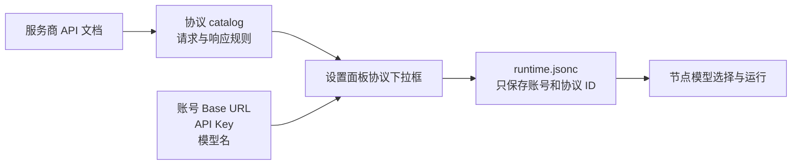

# 模型配置与协议接入

[English](../en/model-providers.md) · [中文文档首页](../README.md) · [使用指南](./user-guide.md)

这篇文档面向实际使用 OpenReel Studio 的创作者和部署者。普通用户只需要在设置面板里配置账号；只有服务商接口与内置协议不兼容时，才需要编写协议文件。

## 先判断你属于哪种情况

| 你的情况 | 应该怎么做 |
| --- | --- |
| 配置 LLM | 直接在“设置 → LLM 模型”添加 Provider。 |
| 图片、视频或音频服务已经出现在协议下拉框 | 直接在对应 Provider 页面填写 Base URL、模型名和 API Key。 |
| 模型名不同，但 HTTP 接口与已有协议完全一致 | 仍可选择已有协议，模型名填写服务商实际 ID。 |
| 提交路径、请求字段、鉴权、轮询或结果结构不同 | 先在 `config/*_provider_protocols/catalog.json` 增加协议，再回前端选择它。 |

模型名相同不代表协议相同。判断能否复用协议时，应对照服务商文档检查 HTTP 方法、路径、鉴权、请求体、异步任务状态和结果字段。

## 配置的两层结构



- `config/runtime.jsonc` 是本机运行配置，保存账号、Base URL、API Key、模型名、启用状态和协议 ID。
- `config/image_provider_protocols/catalog.json`、`video_provider_protocols/catalog.json`、`audio_provider_protocols/catalog.json` 是可共享的 HTTP 适配规则。
- Provider 的 `params` 只引用 `image_protocol_id`、`video_protocol_id` 或 `audio_protocol_id`，不能内嵌一整段协议对象。
- Workflow V2 Spec 只描述输入、步骤和依赖。模型名、比例、分辨率和 Provider 连接信息由前端产物设置与运行配置提供，不写进可复用 Workflow Spec。

## 普通用户：在前端配置 LLM

打开右上角“设置”，默认进入“LLM 模型”。LLM 与图片、视频、音频服务彼此独立；只配置 LLM 不会自动获得媒体生成能力。


### 三档模型怎么选

| 档位 | 主要用途 | 建议 |
| --- | --- | --- |
| 强模型 | 主 Agent、复杂创作、长文本和复杂推理 | 选择能力最完整、上下文较大的模型。 |
| 平衡模型 | 常规生产、图片提示词、一般 worker | 在质量、速度和成本之间取平衡。 |
| 小模型 | 审查、摘要和轻量辅助任务 | 选择响应快、成本低的模型。 |

每个档位可以添加多个 Provider，并指定一个“档位默认”。没有单独任务映射时，后端按任务所属档位选择默认 Provider。

### 添加步骤

1. 在目标档位点击“添加”。
2. 填写名称、Provider 前缀、模型名、Base URL 和 API Key。
3. 按服务商真实能力填写上下文窗口、最大输入和最大输出。
4. 明确模型是否支持 Prompt Cache 和视觉输入；不确定时保留“未填写”。
5. 保持“启用”，点击“保存”。
6. 如果该档位已有多个模型，选择“设为档位默认”。

### LLM 字段说明

| 前端字段 | 怎么填 |
| --- | --- |
| 名称 | 本地唯一名称，例如 `studio-strong`。任务映射引用的是这个名称。 |
| 策略档位 | `strong`、`balanced` 或 `small`。 |
| Provider 前缀 | LiteLLM Provider，例如 `openai`、`anthropic`、`deepseek`、`dashscope`、`gemini`。 |
| 模型名 | 服务商实际模型 ID，例如 `gpt-4.1`。已包含 `/` 时后端不会再拼接 Provider 前缀。 |
| Base URL | 前端当前要求必填。填写服务商或中转站的 API 根地址，不要填写聊天完成的完整资源路径。 |
| 上下文窗口 tokens | 模型完整上下文容量，用于上下文使用率和压缩监控。 |
| 最大输入 tokens | 服务商允许的输入上限，不能大于上下文窗口。 |
| 最大输出 tokens | 默认输出上限，不能大于上下文窗口；不填时默认按 4000 使用。 |
| Prompt Cache | 只按服务商真实能力选择，用于缓存统计。 |
| 视觉输入 | 模型能否接收 `image_url`。选“不支持”后，聊天调用不会向它发送图片项。 |
| API Key | 本机账号密钥。设置页使用密码输入框显示。 |

如果模型 ID 已写成 `openai/gpt-4.1`，Provider 前缀仍可填 `openai`；后端检测到模型名已有 `/` 后不会生成重复前缀。

## 普通用户：在前端配置媒体模型

图片、视频和音频分别维护 Provider。下面以视频为例，图片和音频的操作顺序相同。


### 添加步骤

1. 打开“设置 → 图片 Provider / 视频 Provider / 音频 Provider”。
2. 点击“添加 Provider”。
3. 填写一个便于识别的名称。
4. 填写带版本或 API 命名空间的 `API Base URL`。
5. 填写服务商实际接受的模型 ID；视频页也可以从“推荐模型”选择，自动带出模型名和协议 ID。
6. 从协议下拉框选择与服务商 HTTP 接口匹配的协议。
7. 填写 API Key，按需勾选“默认”和“启用”，然后保存。
8. 保存后打开一个对应类型的节点，在节点模型下拉框确认该 Provider 可见，再做一次最小真实运行。

当前设置页没有独立的“测试连接”按钮。保存只说明配置通过本地 schema 校验，不代表外部服务一定可调用。最终验证以节点的最小真实请求为准。

### 媒体字段说明

| 前端字段 | 怎么填 |
| --- | --- |
| 名称 | 同一媒体类型内唯一，例如 `seedance-production`。 |
| API Base URL | 带版本的 API 根地址，例如 `https://api.example.test/v1` 或 `https://ark.example.test/api/v3`。 |
| 推荐模型 | 由视频协议的 `model_profiles` 动态生成；它只帮你填写模型名和协议 ID。 |
| 模型名 | 中转站或官方接口实际接受的模型 ID，不要按展示名称猜。 |
| 图片/视频/音频协议 | 从对应 `catalog.json` 动态读取。协议决定请求、轮询和结果解析。 |
| API Key | 与 Base URL 属于同一服务商或中转站的密钥。 |
| 默认 | 同一类型最多一个默认 Provider；节点未显式选模型时使用它。 |
| 启用 | 关闭后不应出现在正常节点模型选择中。 |

### Base URL 最容易填错

后端把 Base URL 按字面使用，只在末尾追加协议资源路径：

```text
Base URL:  https://relay.example.test/v1
协议 path: /videos/generations
最终地址:  https://relay.example.test/v1/videos/generations
```

不要只填裸域名，也不要把完整资源路径填进 Base URL：

```text
错误：Base URL https://relay.example.test
错误：Base URL https://relay.example.test/v1/videos/generations
正确：Base URL https://relay.example.test/v1
```

协议 `path` 只写 `/images/generations`、`/videos`、`/audio/speech` 等资源路径，不重复 `/v1`、`/v2` 或 `/api/v3`。

### 高级设置里的图片输入

- `data_url`：默认方式。本地项目图片会转成 Base64/data URL，已有公网 URL 保持 URL。
- `public_url`：服务商只接受公网图片地址时使用，并填写“公网根地址”。该地址必须能把项目 `/api/media/...` 资源暴露给外部服务商访问。
- 视频和音频参考通常也是 URL 输入。服务商无法访问本机或内网地址时，需要公网媒体地址或符合协议的上传步骤。
- 如果协议的 `upload`、`request` 或 `poll` 使用 `base_url_param`，设置页会自动出现额外 Base URL 必填项。

## 高级用户：编写媒体协议

### 协议文件位置和版本

| 类型 | Catalog 版本 | 单条协议版本 |
| --- | --- | --- |
| 图片 | `openreel.image_provider_catalog.v1` | `openreel.image_provider.v1` |
| 视频 | `openreel.video_provider_catalog.v1` | `openreel.video_provider.v1` |
| 音频 | `openreel.audio_provider_catalog.v1` | `openreel.audio_provider.v1` |

```text
config/
  image_provider_protocols/catalog.json
  video_provider_protocols/catalog.json
  audio_provider_protocols/catalog.json
```

Catalog 是严格 JSON，不支持注释。根对象使用 `version` 和 `protocols`；推荐让 `protocols` 使用以协议 ID 为 key 的对象。协议 key、协议内部 `id` 和 Provider 保存的 `*_protocol_id` 必须完全一致。

部署时可以用以下环境变量改用另一份单文件 Catalog：

- `OPENREEL_IMAGE_PROTOCOLS_FILE`
- `OPENREEL_VIDEO_PROTOCOLS_FILE`
- `OPENREEL_AUDIO_PROTOCOLS_FILE`

设置后应编辑环境变量指向的文件，而不是仓库默认文件。

### 通用协议字段

| 字段 | 作用 |
| --- | --- |
| `version` | 单条协议版本，必须与媒体类型对应。 |
| `id` | 稳定协议 ID，必须与 `protocols` 中的 key 一致。 |
| `display_name` | 设置页协议下拉框显示名称。 |
| `default_base_url` | 文档和默认值；用户填写的 Provider Base URL 优先。 |
| `default_params` | 协议默认请求参数。 |
| `model_profiles` | 按模型 ID 声明默认参数、比例、分辨率、模式等能力。 |
| `request` | 提交请求的方法、资源路径、鉴权、请求模板和任务 ID 路径。 |
| `poll` | 异步任务的轮询路径、状态字段、终态集合、间隔和超时。 |
| `result` | 图片、视频或音频结果的提取路径。 |
| `upload` | 可选的先上传步骤。 |

鉴权可在协议或具体 section 中声明：

- `"auth": "bearer"`：发送 `Authorization: Bearer <API Key>`。
- `"auth": "api_key_header"` 配合 `"api_key_header": "X-API-Key"`：把密钥放入指定 header。
- `"auth": "raw"`：把 API Key 原样写入 `Authorization`。

不要把真实密钥写入 Catalog 的静态 `headers`。Catalog 可以提交到 Git，密钥只能留在 `runtime.jsonc`、环境变量或部署 Secret。

### 请求模板占位符

`request.body` 会递归替换 `$变量`；空值会被省略，`false` 和 `0` 会保留。常用变量如下：

| 类型 | 常用变量 |
| --- | --- |
| 通用 | `$model`、`$prompt` |
| 图片 | `$size`、`$quality`、`$count`、`$negative_prompt`、`$response_format`、`$reference_image_input`、`$reference_images` |
| 视频 | `$content`、`$duration_seconds`、`$aspect_ratio`、`$resolution`、`$mode`、`$image_urls`、`$first_image_url`、`$video_urls`、`$audio_urls`、`$generate_audio`、`$watermark` |
| 音频 | `$input`、`$text`、`$voice`、`$response_format`、`$speed`、`$instructions`、`$title`、`$style`、`$instrumental` |

对象路径使用点号和数组下标，例如 `data.task.id`、`data.0.url`。应根据真实响应填写多条候选路径，先写最准确的路径。

### 图片协议最小示例

下面的例子适用于同步返回 URL 或 Base64 的 OpenAI-compatible 接口：

```json
{
  "version": "openreel.image_provider_catalog.v1",
  "protocols": {
    "example_images": {
      "version": "openreel.image_provider.v1",
      "id": "example_images",
      "display_name": "Example images API",
      "default_base_url": "https://api.example.test/v1",
      "default_params": {
        "size": "1024x1024"
      },
      "model_profiles": [
        {
          "match": "example-image-model",
          "default_params": {
            "size": "1024x1024"
          }
        }
      ],
      "request": {
        "method": "POST",
        "path": "/images/generations",
        "auth": "bearer",
        "merge_extra": true,
        "body": {
          "model": "$model",
          "prompt": "$prompt",
          "n": "$count",
          "size": "$size",
          "quality": "$quality",
          "image": "$reference_image_input"
        }
      },
      "result": {
        "images_path": "data",
        "url_path": "url",
        "b64_path": "b64_json",
        "image_url_paths": ["data.0.url", "images.0.url", "url"],
        "b64_paths": ["data.0.b64_json", "b64_json"]
      }
    }
  }
}
```

如果接口先返回任务 ID，可以在 `request.task_id_paths` 声明任务字段，再增加与视频类似的 `poll` 和结果路径。

### 视频异步协议完整示例

假设服务商的创建响应是 `{"data":{"id":"job_123"}}`，轮询响应是 `{"data":{"status":"succeeded","video_url":"https://..."}}`：

```json
{
  "version": "openreel.video_provider_catalog.v1",
  "protocols": {
    "example_video_task": {
      "version": "openreel.video_provider.v1",
      "id": "example_video_task",
      "display_name": "Example async video",
      "default_base_url": "https://api.example.test/v1",
      "image_transport": "data_url",
      "supported_ratios": ["16:9", "9:16", "1:1"],
      "duration": {
        "min": 5,
        "max": 10
      },
      "model_profiles": [
        {
          "match": "example-video-model",
          "label": "Standard",
          "supported_resolutions": ["720p", "1080p"],
          "default_resolution": "720p"
        }
      ],
      "modes": {
        "text_to_video": {
          "label": "Text to video",
          "prompt_required": true,
          "max_images": 0,
          "max_videos": 0,
          "max_audios": 0
        },
        "first_frame": {
          "label": "First frame to video",
          "prompt_required": true,
          "required_roles": ["first_frame"],
          "allowed_roles": ["first_frame"],
          "min_images": 1,
          "max_images": 1
        }
      },
      "request": {
        "method": "POST",
        "path": "/videos/generations",
        "auth": "bearer",
        "task_id_paths": ["data.id", "id"],
        "body": {
          "model": "$model",
          "prompt": "$prompt",
          "image": "$first_image_url",
          "duration": "$duration_seconds",
          "aspect_ratio": "$aspect_ratio",
          "resolution": "$resolution"
        }
      },
      "poll": {
        "method": "GET",
        "path": "/videos/generations/{task_id}",
        "status_path": "data.status",
        "succeeded": ["succeeded"],
        "failed": ["failed", "cancelled", "expired"],
        "running": ["queued", "running", "processing"],
        "interval_seconds": 10,
        "timeout_seconds": 1200
      },
      "result": {
        "video_url_paths": ["data.video_url", "video_url", "url"]
      }
    }
  }
}
```

视频能力应写在协议、`model_profiles` 或具体 `modes` 中。前端只展示当前协议明确声明的比例、分辨率和模式；不要把模型能力硬编码进 Workflow Spec。

当上传接口使用另一个 API 版本时，在 section 中声明额外 Base URL：

```json
{
  "upload": {
    "method": "POST",
    "base_url_param": "upload_base_url",
    "base_url_label": "上传 API Base URL",
    "base_url_hint": "填写上传接口使用的版本化 API 根地址",
    "path": "/files",
    "auth": "bearer"
  }
}
```

保存 Provider 时，设置页会自动要求填写 `params.upload_base_url`。

### 音频协议最小示例

同步返回二进制音频的接口可以这样写：

```json
{
  "version": "openreel.audio_provider_catalog.v1",
  "protocols": {
    "example_audio_speech": {
      "version": "openreel.audio_provider.v1",
      "id": "example_audio_speech",
      "display_name": "Example audio speech",
      "default_base_url": "https://api.example.test/v1",
      "default_params": {
        "voice": "alloy",
        "response_format": "mp3"
      },
      "model_profiles": [
        {
          "match": "example-tts-model"
        }
      ],
      "request": {
        "method": "POST",
        "path": "/audio/speech",
        "auth": "bearer",
        "required_context": ["input"],
        "body": {
          "model": "$model",
          "input": "$input",
          "voice": "$voice",
          "response_format": "$response_format",
          "speed": "$speed"
        }
      },
      "result": {
        "type": "binary",
        "format_param": "response_format"
      }
    }
  }
}
```

如果服务商返回音频 URL 或异步任务，改用 URL 结果路径或增加 `request.task_id_paths`、`poll` 和状态集合。

## 协议写完后如何让前端使用

1. 把协议加入正确类型的 `catalog.json`，保持文件为合法 JSON。
2. 检查根 Catalog 版本、单条协议版本，以及 key 与 `id` 是否一致。
3. 打开设置面板并点击右上角“刷新”。后端会重新读取 Catalog，通常不需要重启。
4. 进入对应媒体 Provider，点击“添加 Provider”。
5. 填写 Base URL、模型名和 API Key，并从下拉框选择刚添加的协议。
6. 保存后创建最小节点，选择该 Provider，使用服务商明确支持的最小参数运行一次。
7. 验证成功后再增加参考图、多媒体输入、长时长、高分辨率或批量工作流。

“配置文件”标签页编辑的是 `runtime.jsonc`，不是协议 Catalog。它适合批量修改账号或使用 `${ENV_VAR}`，不能代替新增协议。

## 文件配置示例

普通用户优先使用前端。需要部署 Secret 或批量配置时，可以复制 `config/runtime.example.jsonc`，并让密钥引用环境变量：

```jsonc
{
  "$schema_version": 1,
  "llm_providers": [],
  "media_providers": [
    {
      "kind": "video",
      "name": "example-video",
      "base_url": "https://api.example.test/v1",
      "api_key": "${VIDEO_API_KEY}",
      "model_name": "example-video-model",
      "api_format": "video_http_v1",
      "is_active": true,
      "enabled": true,
      "notes": "",
      "params": {
        "video_protocol_id": "example_video_task",
        "image_transport": "data_url"
      }
    }
  ],
  "model_tier_defaults": {
    "strong": null,
    "balanced": null,
    "small": null
  },
  "model_assignments": {},
  "app_settings": {}
}
```

`runtime.jsonc` 支持注释，Catalog 只支持严格 JSON。配置文件校验失败时，旧的已生效配置会保留。

## 最小验证与排障

### 建议的验证顺序

1. 先保存并启用 Provider。
2. 确认节点模型下拉框能看到 Provider 或模型。
3. 图片先用单句提示词和协议默认尺寸。
4. 视频先用协议支持的最短时长、默认分辨率和文生视频模式；确认后再加首帧或多模态参考。
5. 音频先用短文本和默认 voice/format。
6. 查看节点错误中的 endpoint、HTTP 状态、provider 响应摘要和任务 ID。

### 常见错误定位

| 现象 | 优先检查 |
| --- | --- |
| 保存按钮不可用 | 名称、Base URL、模型名、API Key、协议 ID或协议要求的额外 Base URL是否缺失。 |
| 协议不在下拉框 | Catalog 路径、JSON 语法、Catalog 版本、协议 key/id，或环境变量是否指向另一文件。 |
| 401 / 403 | API Key、鉴权形式和 Base URL 是否属于同一服务商。 |
| 404 | Base URL 是否缺版本，或协议 `path` 是否重复 `/v1`、`/v2`、`/api/v3`。 |
| 400 / 422 | `request.body` 字段名、模型名、模式、比例、时长、分辨率和媒体数量。 |
| 创建成功但没有任务 ID | `request.task_id_paths` 与创建响应不一致。 |
| 一直轮询 | `poll.path`、`status_path`、running/succeeded/failed 状态值不一致。 |
| 显示成功但没有媒体 | `result.*_url_paths`、图片 Base64 路径或二进制结果类型不一致。 |
| 本地参考图无法发送 | `image_transport`、`public_base_url`、服务商是否支持 data URL，或是否需要 `upload`。 |
| `bad response body` | 服务商响应结构与协议结果提取规则不一致。 |

修复配置后重试原节点。一次生成失败不会删除最近一次成功预览，不需要为了排障清空画布。

## 安全边界

- 前端设置会把账号配置保存到本机 `config/runtime.jsonc`；只在可信设备和受保护的 Studio 服务上使用设置页。
- 公网部署必须先加访问控制，不要把未鉴权的设置 API 暴露给互联网。
- 不要提交 `runtime.jsonc`、`.env`、真实 API Key、完整请求头、服务商私有响应或用户素材。
- 可提交的协议示例使用 `example.test`、占位模型名和环境变量。
- 新协议进入仓库前，应增加 endpoint、请求体、轮询、结果提取、错误状态和 Base URL 合同测试。
